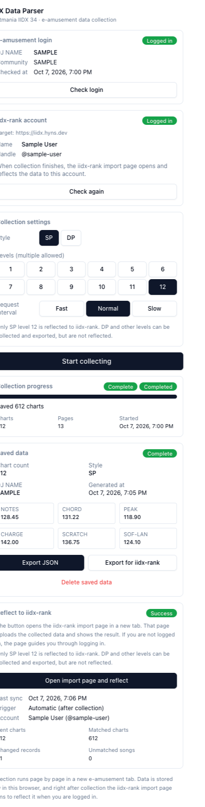

<div align="center">


# IIDX Data Parser

**A Chrome extension that collects your beatmania IIDX play data from e-amusement and reflects it to IIDX Rank.**

[Chrome Web Store](https://chromewebstore.google.com/detail/iidx-data-parser/ihhbemlpcommigeghkpfahgncipbikmk) · [IIDX Rank](https://iidx.hyns.dev) · [How it works](#how-it-works) · [Development](#development)

</div>

<div align="center">



</div>

IIDX Data Parser reads your own DJ data from the beatmania IIDX 34 ZINRAI pages of e-amusement while you are logged in, keeps it in your browser, and hands it to the [IIDX Rank](https://iidx.hyns.dev) import page. That page uploads the data to the account you are logged in with and shows the result. The extension never asks for your e-amusement or IIDX Rank password. It is an unofficial project and is not affiliated with KONAMI.

## Features

- **Login detection** — checks whether you are logged in to e-amusement; while you are not, or the state is unknown, the collection button stays disabled and the reason is shown
- **DJ data** — DJ NAME, IIDX ID, DJ POINT, play count and the six notes radar axes from `djdata/status.html`
- **Notes radar** — collected from `djdata/music/notesradar.html`
- **Per-level chart records** — walks `djdata/music/difficulty.html` for the levels and play style (SP/DP) you pick, 50 entries per page
- **Request interval** — Fast (300–650 ms), Normal (500–1100 ms, default) or Slow (900–1600 ms) between page requests
- **Reflect to IIDX Rank** — when collection finishes, the IIDX Rank import page opens in a new tab and shows the upload result; the last result (in progress, time, counts, unmatched songs, failure reason) also stays in the popup, and you can reflect again manually. Only SP level 12 is reflected; DP and other levels are collected and exported only
- **JSON export** — the full `dataset` v2 and the `rank-import` v2 format for IIDX Rank, saved as files
- **Delete saved data** — clears the collected data and the last reflection result after a confirmation step
- **Localized** — English · 한국어 · 日本語 (follows the browser language)

## Install

Install **IIDX Data Parser** from the [Chrome Web Store](https://chromewebstore.google.com/detail/iidx-data-parser/ihhbemlpcommigeghkpfahgncipbikmk).

- Chrome 116 or later
- To build and load it yourself, see [Development](#development)

## How it works

1. Log in to e-amusement in the same browser, then press **Check login** in the popup.
2. Log in to [IIDX Rank](https://iidx.hyns.dev). The popup shows the account once it is logged in; if it is not, **Open iidx-rank login** opens the login page.
3. Choose the play style, levels and request interval, then press **Start collecting**. **Cancel collection** halts it at any time.
4. When collection finishes, the IIDX Rank import page opens in a new tab and shows the result; the same result stays on the popup's reflect card. To reflect again, press **Open import page and reflect**. Without an IIDX Rank login the import page guides you through logging in and continues with the same data.

Collected data is normalized and saved in `chrome.storage.local`.

### Scope and limits

- Collection targets the IIDX 34 paths only. When the game version changes, replace `GAME_VERSION` in `src/shared/constants.ts`.
- `missCount` is not collected (always `null`). DP is not reflected to IIDX Rank.
- Automatic login and periodic sync are out of scope.

## Permissions

| Permission               | Why it is needed                                                                          |
| ------------------------ | ----------------------------------------------------------------------------------------- |
| `storage`                | Keeps the collected data, login state, settings and last reflection result in the browser |
| `p.eagate.573.jp` (host) | Reads the e-amusement pages to collect and checks the URL of the collection tab           |
| `iidx.hyns.dev` (host)   | Checks the IIDX Rank session and hands the collected data to the import page              |

`tabs` and `unlimitedStorage` are not requested. The reasoning is in the permission boundary section of [docs/ARCHITECTURE.md](docs/ARCHITECTURE.md).

## Privacy

- The extension does not read or store your e-amusement or IIDX Rank password, nor cookie values. It reuses the logins already in your browser.
- Collected data stays in your browser until you reflect it to IIDX Rank or export it yourself. Besides e-amusement, the only origin the extension talks to is IIDX Rank, and the upload itself is made by the IIDX Rank import page.
- See the [privacy policy](https://iidx.hyns.dev/en/privacy).

## Development

```sh
bun install
bun run build       # bundle into build/
bun run dev         # rebuild on file changes
bun run typecheck   # tsc --noEmit
bun test
bun run pack        # build and zip into release/
```

To load a build: open `chrome://extensions`, turn on Developer mode, choose **Load unpacked** and select `build/`. The IIDX Rank origin is fixed at build time through `RANK_ORIGIN` (default `https://iidx.hyns.dev`); for a local server use `RANK_ORIGIN=http://localhost:3000 bun run build`. The extension does not call the IIDX Rank import API itself, so no extension ID has to be registered on the server.

Chrome Manifest V3 service worker, built with Bun.build, with a React 18 popup (Tailwind 3, Zod schemas) split into FSD-style layers. Documentation lives in [docs/](docs) (Korean):

- [docs/ARCHITECTURE.md](docs/ARCHITECTURE.md) — components, collection orchestration, popup, i18n, permission boundary
- [docs/DATA_SCHEMA.md](docs/DATA_SCHEMA.md) — dataset JSON v2 and rank-import v2 formats
- [docs/INTEGRATION.md](docs/INTEGRATION.md) — how data is reflected through the IIDX Rank import page, and the message contract
- [docs/PARSING-NOTES.md](docs/PARSING-NOTES.md) — evidence for the e-amusement page structure
- [docs/VERIFICATION.md](docs/VERIFICATION.md) — automated checks and manual verification steps
